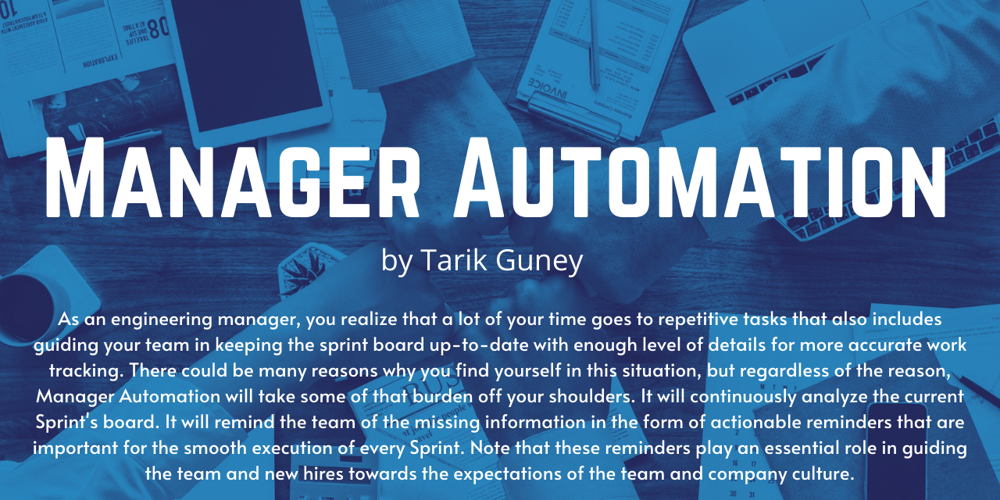
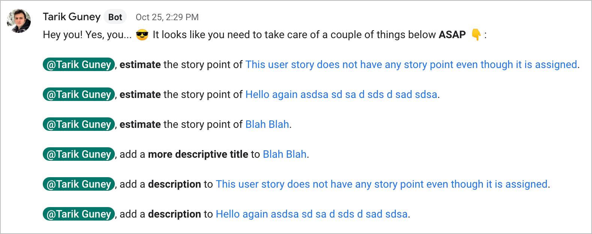
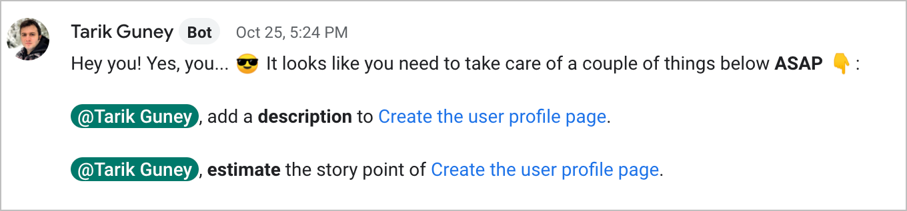
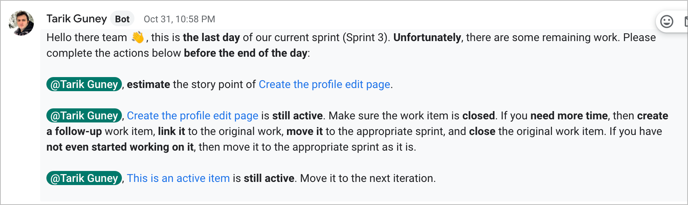
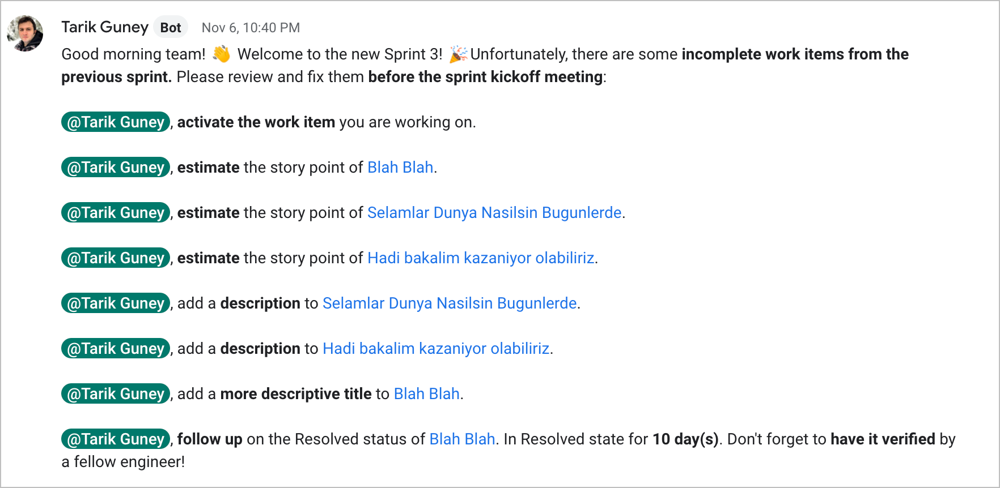
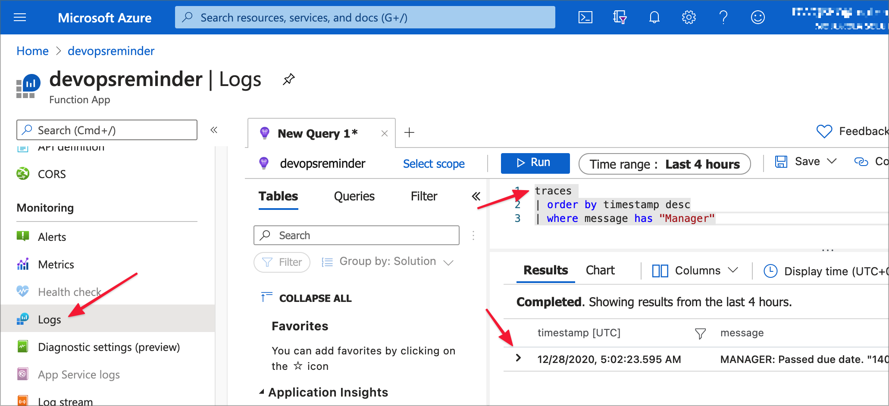
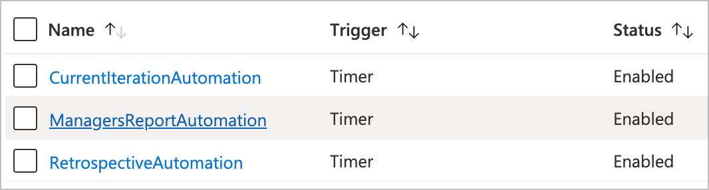
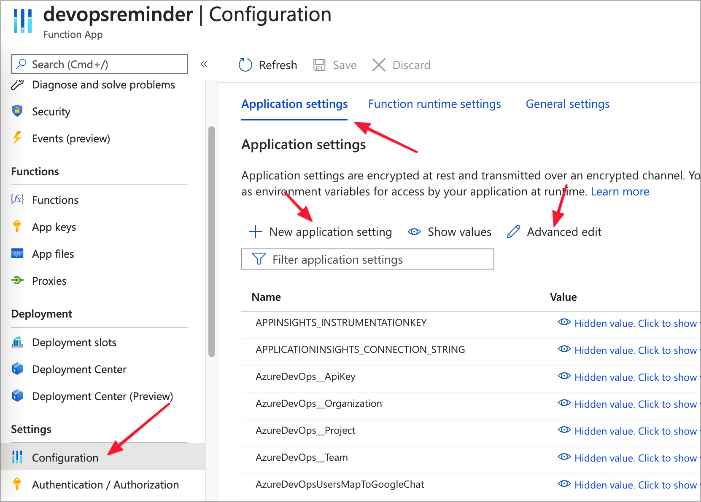
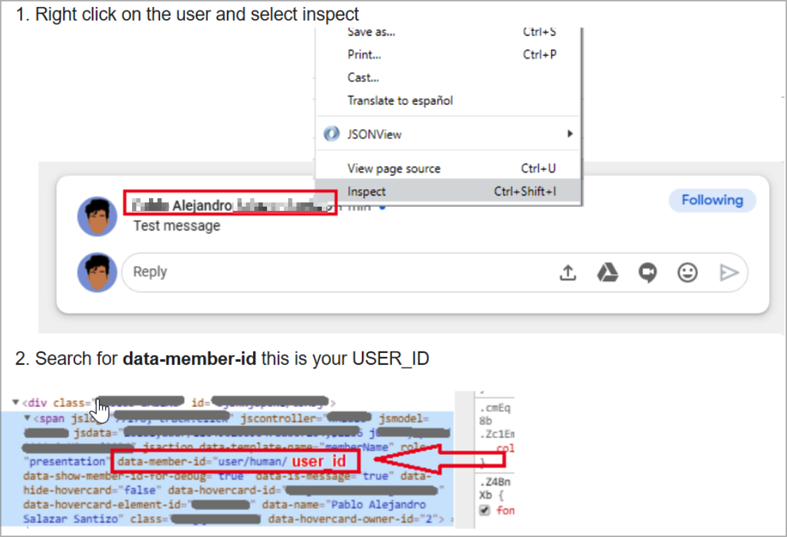

Developed with the following technologies by [@tarikguney](https://github.com/tarikguney)

  



Table of Contents
=================
<!--ts-->
   * [Table of Contents](#table-of-contents)
   * [What is it?](#what-is-it)
   * [What's new in Version 2](#whats-new-in-version-2)
   * [Underlying Design Principle](#underlying-design-principle)
   * [How does it look?](#how-does-it-look)
      * [In-Sprint action reminders](#in-sprint-action-reminders)
      * [End-of-sprint action reminders](#end-of-sprint-action-reminders)
      * [New Sprint action reminders](#new-sprint-action-reminders)
      * [Managers-only reminders](#managers-only-reminders)
   * [Reporting](#reporting)
      * [What's being logged?](#whats-being-logged)
      * [Real-world log samples from the console](#real-world-log-samples-from-the-console)
      * [Where to find the logs in Application Insights?](#where-to-find-the-logs-in-application-insights)
   * [The Complete List of Reminders](#the-complete-list-of-reminders)
      * [Current Iteration Automation](#current-iteration-automation)
      * [End of the Sprint Reminders](#end-of-the-sprint-reminders)
      * [Retrospective Automation](#retrospective-automation)
      * [Managers-only Automation](#managers-only-automation)
   * [Setup and Configuration](#setup-and-configuration)
      * [Dependencies](#dependencies)
      * [Publishing to Azure Functions](#publishing-to-azure-functions)
      * [App Settings](#app-settings)
         * [Available settings](#available-settings)
         * [Where to put the app settings?](#where-to-put-the-app-settings)
         * [Explanation of each setting](#explanation-of-each-setting)
            * [AzureDevOps__ApiKey](#azuredevops__apikey)
            * [AzureDevOps__Organization](#azuredevops__organization)
            * [AzureDevOps__Project](#azuredevops__project)
            * [AzureDevOps__Team](#azuredevops__team)
            * [AzureDevOpsUsersMapToGoogleChat](#azuredevopsusersmaptogooglechat)
            * [EngineeringManagerInfo__AzureDevOpsEmail](#engineeringmanagerinfo__azuredevopsemail)
            * [EngineeringManagerInfo__GoogleChatUserId](#engineeringmanagerinfo__googlechatuserid)
            * [EngineeringManagerInfo__ManagerRemindersGoogleWebhookUrl](#engineeringmanagerinfo__managerremindersgooglewebhookurl)
            * [GoogleChat__WebhookUrl](#googlechat__webhookurl)
            * [WEBSITE_TIME_ZONE](#website_time_zone)
         * [Finding Google Chat Id (UserId)](#finding-google-chat-id-userid)
   * [FAQ](#faq)

<!-- Added by: tarikguney, at: Sun Feb  7 23:24:33 MST 2021 -->

<!--te-->

# What is it?
**As an engineering manager, you realize that a lot of your time goes to repetitive tasks which also include guiding your team in keeping the sprint board up-to-date with enough level of details for an accurate work tracking.** There could be many reasons why you find yourself in this situation, but regardless of the reason, Manager Automation will take some of that burden off your shoulders. It will continuously analyze the current Sprint's board. It will remind the team of the missing information in the form of actionable reminders that are important for the smooth execution of every Sprint. **Note that these reminders play an essential role in guiding the team and new hires towards the expectations of the team and company culture.**
# What's new in Version 2

There is already a project of mine named [Manager Automation](https://github.com/tarikguney/manager-automation), but as I was learning [Akka.NET](https://getakka.net), I decided to re-write the entire project in Akka. The original version was written in [TPL Dataflow](https://docs.microsoft.com/en-us/dotnet/standard/parallel-programming/dataflow-task-parallel-library), which is a great library; but overall, I found the [Actor Model](https://en.wikipedia.org/wiki/Actor_model) constructs more straightforward in Akka than TPL Dataflow. Akka also offers more constructs for the development teams to focus on the business results rather than re-inventing various existing concepts.  Some of the areas Akka.NET offers better development support that I am interested in this project are:

1. [Dependency Injection](https://getakka.net/articles/actors/dependency-injection.html)

2. [Streaming](https://getakka.net/articles/streams/introduction.html)

3. [Testing Actors](https://getakka.net/articles/actors/testing-actor-systems.html)

My newly acquired experience from this re-write of this project in Akka.NET will be incorporated into [Projekt Hive](https://github.com/tarikguney/projekt-hive), which is planned to be a complete re-imagination of [Manager Automation](https://www.github.com/tarikguney/manager-automation) from the ground up.

If you are interested in Akka.NET and want to see a project being re-written with actors, then follow this project. You can compare the original commit to the latest commit to see the evolution of the project. It is probably a rare moment to see a live project, that is originally written with TPL Dataflow, being re-written in Akka.NET. So, enjoy, and don't forget to leave your comments and suggestions on the [Discussions](https://github.com/tarikguney/manager-automation-v2/discussions) page.

# Underlying Design Principle
The communication of the reminders in the solution is intentionally done in a public team chat room. Besides being public, the messages are kept straightforward too. It communicates the required actions through Google Chat (and Slack, etc., in the future) in simple and concise words. It is visible and repetitive, as these are perhaps some of the most effective factors to incorporate cultural elements into a team's daily life. Rare communication of hard-to-remember tasks will not make it into the team culture early enough. They have to be communicated frequently in a place where they are most visible to make them easy to follow by the team to become a part of the team culture.

# How does it look?

There are some screenshots of the messages below for you to see what's being communicated. Note that the source code will be the best place to check for the full list of messages and communication for now.

## In-Sprint action reminders
Manager Automation service sends daily reminders as demonstrated in the screenshots below. These series of reminders ensure the necessary actions being taken by the team members. The reminders use Google Chat's name mentioning feature to help the targeted team members to get on-time and relevant notifications through the Google Chat.





## End-of-sprint action reminders
Manager Automation service embeds specific situational facts in the reminder text. For example, it changes its greeting when it is the last day of the Sprint to draw people's attention to the fact that the Sprint is about to end, and there might be some missing work in the Sprint. It also guides the team members on how the incomplete work must be handled based on the time available and committed time for the work item estimated by the engineer.



## New Sprint action reminders
When it is the first day of the new Sprint, the automation service will analyze the previous Sprint one more time and bring up any issues that are left unresolved.



## Managers-only reminders
As an engineering manager, it is often crucial to be aware of the work's progression on time and catch the delay before becoming a big problem. There might be many reasons why work is delayed. For instance, engineering might be blocked. Regardless of the reason, if a task is taking an unreasonable amount of time, you will need to reach out and see what's going on and how you can help the team member with the progression of the work. The Manager Automation service collects this information for you -- the engineering manager -- and reports them daily in a private Google Chat room.


# Reporting

Reporting is one of the most important capabilities of the Manager Automation tool. The daily reminders are also sent to the [**Azure Application Insights**](https://docs.microsoft.com/en-us/azure/azure-monitor/app/app-insights-overview) for a further review by the team and the engineering manager. You can write up reports using these logs to better understand the team's performance and improvement over time. It is up to you when it comes to how to use these reporting capabilities, but a recommended approach is to help the team grow by helping them see what areas they need to work to improve. For instance, if they are not good at estimating the work items, they can objectively see this problem area in the reports and work to improve it over a course of time.

The reporting is a fairly new addition to the manager automation, hence, the documentation lacks enough level of details and screenshots. However, it is simple to use when you integrate the Application Insights to your Azure Functions application. Ensure that you select an Application Insights instance (or create a new one) when you first create your function application.

## What's being logged?

These are the logs you will see in the Application Insights logs:

```
BOARD: Missing description for \"{workItemId}:{workItemTitle}\". Assigned to {userEmail} in {currentIteration}.

BOARD: Unclear title for \"{workItemId}:{workItemTitle}\". Assigned to {userEmail} in {currentIteration}.

BOARD: Missing story point for \"{workItemId}:{workItemTitle}\". Assigned to {userEmail} in {currentIteration}.

BOARD: Closed everything from the previous sprint by the first day of the current sprint {currentIteration}. Assigned to {userEmail}.

BOARD: Closed everything in the current sprint {currentIteration}. Assigned to {userEmail}.

BOARD: Pending in incomplete state of {currentState} for {pendingForDays} days. Story \"{workItemId}:{workItemTitle}\". Assigned to {userEmail} in {currentIteration}.

BOARD: Still open in {currentState} state. Story \"{workItemId}:{workItemTitle}\". Assigned to {userEmail} in {currentIteration}."

BOARD: Still in active state. Story \"{workItemId}:{workItemTitle}\". Assigned to {userEmail} in {currentIteration}.
```
Note that all these logs start with `BOARD` to help you distinguish these log entries from the other sort of logs easily.

The log messages above are taken directly from the code. As you might have guessed, they follow [**structural logging**](https://softwareengineering.stackexchange.com/a/312586/3613) pattern; meaning that they can easily be parsed and parameterized with the metadata they carry for each fields as represented by `{ }` as seen in `{workItemId}`.

## Real-world log samples from the console

Samples from console environment:
```
[2020-12-26T21:36:32.640Z] BOARD: Missing story point for "12:Create the profile edit page". Assigned to atarikguney@gmail.com in Sprint 3.
[2020-12-26T21:36:32.643Z] BOARD: Pending in incomplete state of Resolved for 28 days. Story "19:This is an active item". Assigned to atarikguney@gmail.com in Sprint 3.
```

More documentation and examples will follow as this is one of the most critical functionalities of Manager Automation tool.

## Where to find the logs in Application Insights?

The log entries above are logged as trace. This is default log type in Azure Functions runtime. Therefore, when you go to the Log tab on Azure Portal, search the log entries in the trace section. You can also create dashboard for more convenient view. Check out the image below, it will show you how to access the Log and how to perform a simple search to find the relevant log entries for further reporting needs:



# The Complete List of Reminders
This function application consists of three primary functions:
1. Current Iteration Automation
1. End of iteration Automation
1. Retrospective Automation
1. Managers-only Reminders

## Current Iteration Automation
Most of the reminders go out as part of the current iteration automation executions. This automation analyses the current iteration (aka. Sprint) using Azure DevOps API from various points and sends reminders to the responsible parties to make sure they are addressed. These checkpoints are:
- Missing description in work items (defects and user stories)
- Indescriptive work item titles
- Work items without story points
- Work items in Resolve state for more than 12 hours
- Assigned but not activated work items. Reminds the responsible parties to activate the work item they are working.
- Congratulate the ones with all closed work items.

These reminders are sent out twice every day, one in the morning and one in the afternoon.

## End of the Sprint Reminders
On the last day of the Sprint, the reminders change. In addition to the ones above, it also automates:

- If there are work items that are still active, it reminds the possible action items.

## Retrospective Automation
On the first day of the Sprint, this automation checks if there is any remaining work from the previous Sprint. It runs the existing checks and reports them differently, which is more appropriate for the first day of the next Sprint.

## Managers-only Automation

- Due date reminders.

# Setup and Configuration
## Dependencies
This project is developed for **[Azure Functions](https://azure.microsoft.com/en-us/services/functions) with [**.NET Core 3.1**](https://dotnet.microsoft.com/)**. Hence, some basic knowledge in this technology stack is helpful. Also, this service assumes that you are using **[Azure DevOps](https://dev.azure.com)** as the project planning/tracking environment and **[Google Chat](https://chat.google.com)** as the communication medium among your team members.
## Publishing to Azure Functions
Deploying this source code to the Azure Function is easy. This project uses the Library version of Azure Functions. Check out these steps to learn how to publish Azure Functions: [Publish to Azure](https://docs.microsoft.com/en-us/azure/azure-functions/functions-develop-vs#publish-to-azure).

Once you deploy this function app to Azure Functions, these are the functions that will appear on the Azure Portal:



## App Settings

To complete app settings, you need various pieces of information from Azure DevOps and Google Chat.

In addition to the default app settings that come with the Azure Function creation, there are some custom settings that the source code depends on as follows. All of them are required!

### Available settings

```json
[
  {
    "name": "AzureDevOps__ApiKey",
    "value": "PERSONAL-ACCESS-TOKEN-FROM-AZURE-DEVOPS",
    "slotSetting": false
  },
  {
    "name": "AzureDevOps__Organization",
    "value": "ORGANIZATION-NAME-OF-AZURE-DEVOPS",
    "slotSetting": false
  },
  {
    "name": "AzureDevOps__Project",
    "value": "PROJECT-NAME-FROM-AZURE-DEVOPS",
    "slotSetting": false
  },
  {
    "name": "AzureDevOps__Team",
    "value": "TEAM-NAME-FROM-AZURE-DEVOPS",
    "slotSetting": false
  },
  {
    "name": "AzureDevOpsUsersMapToGoogleChat",
    "value": "AZURE-DEVOPS-USER1-EMAIL:GOOGLE-CHAT-ID-1;AZURE-DEVOPS-USER2-EMAIL:GOOGLE-CHAT-ID-2",
    "slotSetting": false
  },
  {
    "name": "EngineeringManagerInfo__AzureDevOpsEmail",
    "value": "ENGINEERING-MANAGER-EMAIL-FROM-AZURE-DEVOPS",
    "slotSetting": false
  },
  {
    "name": "EngineeringManagerInfo__GoogleChatUserId",
    "value": "ENGINEERING-MANAGER-GOOGLE-CHAT-ID",
    "slotSetting": false
  },
  {
    "name": "EngineeringManagerInfo__ManagerRemindersGoogleWebhookUrl",
    "value": "MANAGERS-ONLY-REMINDERS-ROOM-WEBHOOK-URL",
    "slotSetting": false
  },
  {
    "name": "GoogleChat__WebhookUrl",
    "value": "GOOGLE-CHAT-ROOM-WEBHOOK-URL",
    "slotSetting": false
  },
  {
    "name": "WEBSITE_TIME_ZONE",
    "value": "Mountain Standard Time",
    "slotSetting": false
  }
]
```

### Where to put the app settings?

Don't store the application settings in `appsettings.json` file. I recommend `appsettings.json` file only for local development since Azure Functions App have a better place to put the configuration settings via Azure Portal. Visit the `Configuration` link in your Functions instance as shown below:



This way, you don't have re-publish the function app when you change a setting.

### Explanation of each setting

Note that the double underscore (`__`) in the setting names have a [special meaning in .NET Core configurations](https://docs.microsoft.com/en-us/aspnet/core/fundamentals/configuration/?view=aspnetcore-5.0#environment-variables). Basically, they are used to group the settings in the environment variables.

#### `AzureDevOps__ApiKey`

This is your personal access token. Check out this page to see how to get it from Azure DevOps: [**Create a PAT**](https://docs.microsoft.com/en-us/azure/devops/organizations/accounts/use-personal-access-tokens-to-authenticate?view=azure-devops&tabs=preview-page#create-a-pat). When creating your PAT, you can define the scopes this token can access. Keep it limited to the following scopes for most safety:

1. Choose “Custom Defined”
2. Code > Read
3. Project and Team > Read
4. Work Items > Read

Then, follow these steps to generate the API key you need for this setting:
1. Use this format: `:personal-access-token` --> Don't forget to add the colon at the beginning.
2. Encode it with Base64String
3. Use the resulting string as the value for this setting.

#### `AzureDevOps__Organization`

This is the organization of your Azure DevOps. You can infer this value from the URL: `https://dev.azure.com/{organization}`. The first segment in the path of the DevOps URL is the organization. Simply use that value.

#### `AzureDevOps__Project`

You can create multiple projects in Azure DevOps, and this setting requires one of them under which you sprint boards, etc. are all defined. When you go to your organization URL `dev.azure.com/{organization}`, you will be presented with the projects. Simply choose the one you desire and copy their names as they appear on that screen to use as the value of this setting.

#### `AzureDevOps__Team`

You can define teams in Azure DevOps, and boards are associated with teams. Use that team name as the value for this setting. Check out this page to learn more about teams: [**Add team, go from one default team to others**](https://docs.microsoft.com/en-us/azure/devops/organizations/settings/add-teams?view=azure-devops&tabs=preview-page)

#### `AzureDevOpsUsersMapToGoogleChat`

In order to determine whom to send the message to, there should be some mapping between Azure DevOps users and Google Chat users. Google Chat Webhook API only works with Google Chat User Ids, and this setting is to map between these values. Map all of the team members in this setting as the recommended approach. Otherwise, some members may not be properly mentioned in Google Chat. This value accepts multiple mappings separated by semi-colon (`;`). Check out this link to see how to extract Google Chat Id: [Finding Google Chat Id (UserId)](#finding-google-chat-id-userid)

`AZURE-DEVOPS-USER1-EMAIL:GOOGLE-CHAT-ID-1` would translate to `michael.smith@gmail.com:2333181726262`in a real-world setting. Another example with multiple mappings would be as follows: `michael.smith@gmail.com:2333181726262;tarik.guney@fakeaddress.com:23344556311`. Note the `;` as the separator of these mappings. You can add as many as you want.

#### `EngineeringManagerInfo__AzureDevOpsEmail`

Team and project/engineering managers receive different messages. Therefore, project/engineering manager information is asked separately. Use your DevOps email as the value of this setting.

#### `EngineeringManagerInfo__GoogleChatUserId`

Similar to other Google Chat Ids, use the Google Chat Id of the project/engineering manager as the value of this settings. Find out more at [Finding Google Chat Id (UserId)](#finding-google-chat-id-userid)

#### `EngineeringManagerInfo__ManagerRemindersGoogleWebhookUrl`

Google Chat has webhooks to receive messages through. It is really easy to create Webhook URLs through Google Chat as explained here [Using incoming webhooks](https://developers.google.com/hangouts/chat/how-tos/webhooks).

This particular setting is asking for a private room webhook to send [Managers-only Automation](#managers-only-automation) messages.

#### `GoogleChat__WebhookUrl`

Google Chat has webhooks to receive messages through. It is really easy to create Webhook URLs through Google Chat as explained here [Using incoming webhooks](https://developers.google.com/hangouts/chat/how-tos/webhooks).

This particular setting is asking for the team room webhook to send automation messages.

#### `WEBSITE_TIME_ZONE`

This is a pre-defined setting understood by Azure Functions, and is required for determining the time zone for the automation to determine how to calculate time and days to send the messages out. You can find all of the available options here: [Time Zones](https://docs.microsoft.com/en-us/previous-versions/windows/it-pro/windows-vista/cc749073(v=ws.10)#time-zones). Use the values from the left side as they appear, with spaces and such. For example: `Mountain Standard Time`.

### Finding Google Chat Id (UserId)

Google Chat Id is used in the following configuration settings and is important for notifying the right team members through Google Chat.

```json
{
  "name": "AzureDevOpsUsersMapToGoogleChat",
  "value": "AZURE-DEVOPS-USER1-EMAIL:GOOGLE-CHAT-ID-1;AZURE-DEVOPS-USER2-EMAIL:GOOGLE-CHAT-ID-2",
  "slotSetting": false
},
{
  "name": "EngineeringManagerInfo__GoogleChatUserId",
  "value": "ENGINEERING-MANAGER-GOOGLE-CHAT-ID",
  "slotSetting": false
}
```
It is not super straightforward and intuitive to find out what this value is for each team member. It is not an an exposed value on the Google Chat UI; therefore, you need to use the tools like Google Chrome Developer Tools to extract it. You have to copy the numbers next to `user/human/` value in `data-member-id` HTML attribute as shown in the screenshot below:



# FAQ

**Where are the unit tests?**

I originally developed this tool as a small utility service to automate some of my work, but it grew quickly as I realize the potential of this tool. I will be adding unit tests later on.

**Where did the idea come from?**

From my own experiences. I noticed that I could not scale my time if I didn't automate some of my daily tasks, and this project was born. In general, I like developing tools that make my live easier, and I love tools that offer practical impact and improvements to my daily life. You can check out my other projects at [github.com/tarikguney](https://github.com/tarikguney) to explore my other tools that were developed with this simple idea in mind. Since, there are lots of people like myself sharing the same challenges, developing a tool for myself ends up helping a lot of other people out there.


**What's the roadmap/future of this project?**

I have learned quite a bit from this project, and I will be maintaining this project time to time. But, my next project, that will take this simple idea a lot farther, will be [**Projekt Hive**](https://github.com/tarikguney/projekt-hive). I will be incorporating what I have learned so far and more into Projekt Hive.

**How can I contribute?**

There are multiple areas where contribution is needed:

1. Adding more message targets like Slack, Discord, etc. similar to Google Chat.
2. Adding unit tests!
3. Bringing the project to a more unit testable state. I used .NET DataFlow pattern which is little challenging when it comes to Dependency Injection. However, I like to keep the actor pattern in place since it is really suitable for this type of projects.
4. Test it and log bugs in the issues page

Since this is my personal side project, I cannot immediately answer questions or review PRs but I will do my best. So, please feel free to contribute but just be a little patient with me.


